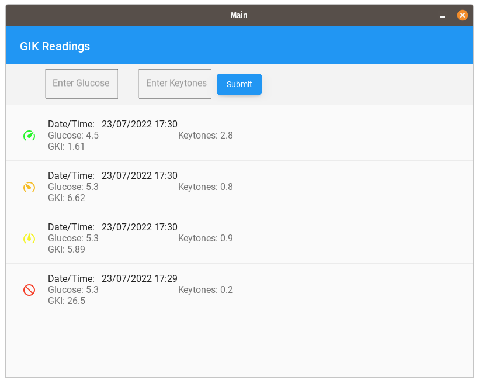
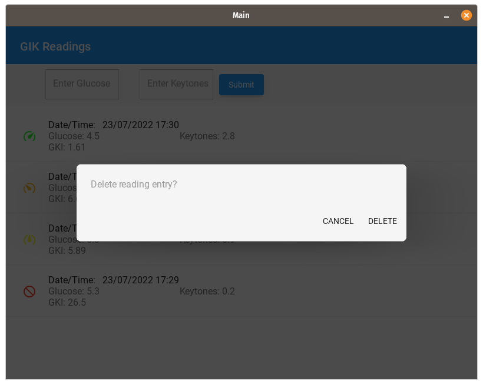
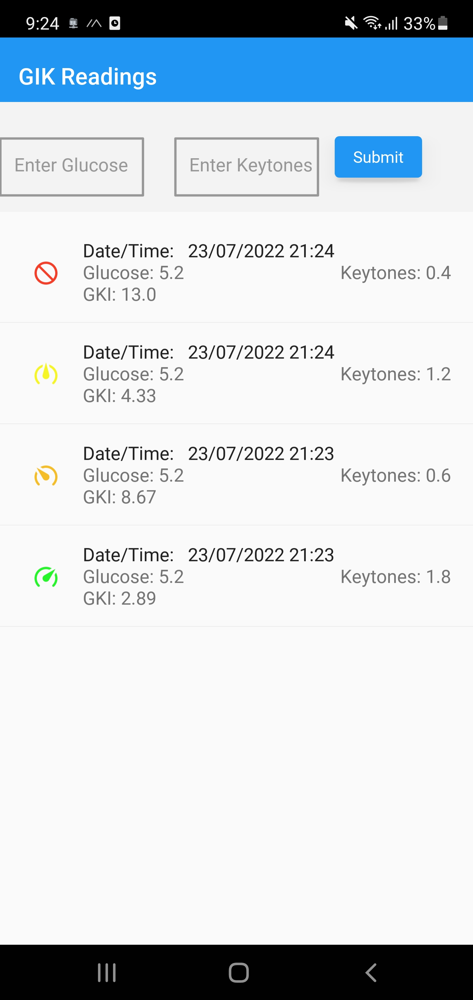
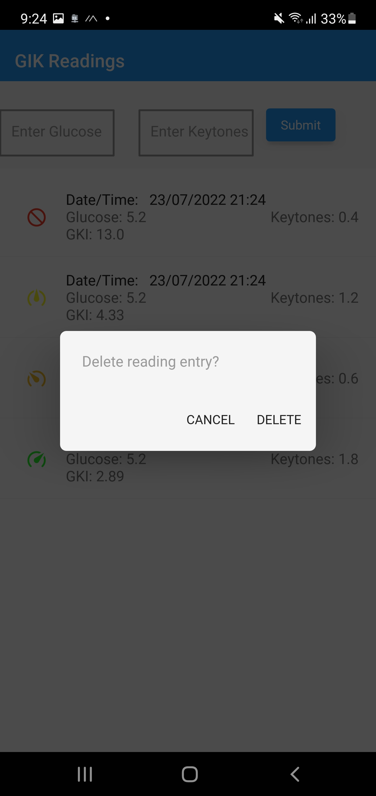

This is intended to track your indavidual glucose and ketone level while you are on keto. This will also calculate your GKI with each reading. 

#### Install requirements
`pip install -r requirements.txt`

### What is working
- SQLite3 database storage of past Readings
- Scrolling list of readings.
- Color Icon based on level GKI 
- GKI calculation

#### Todo
- Add a check box to toggle between mg/dL and mmol/L for user inputs.

### Screenshots
</img></img></img></img>